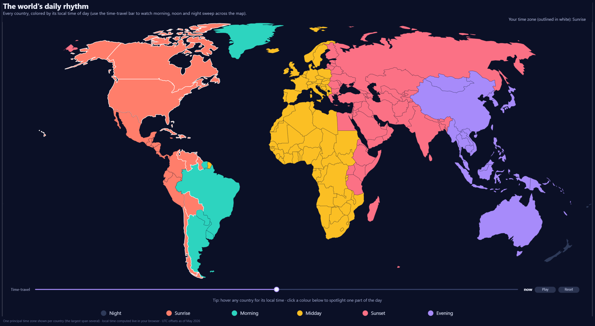
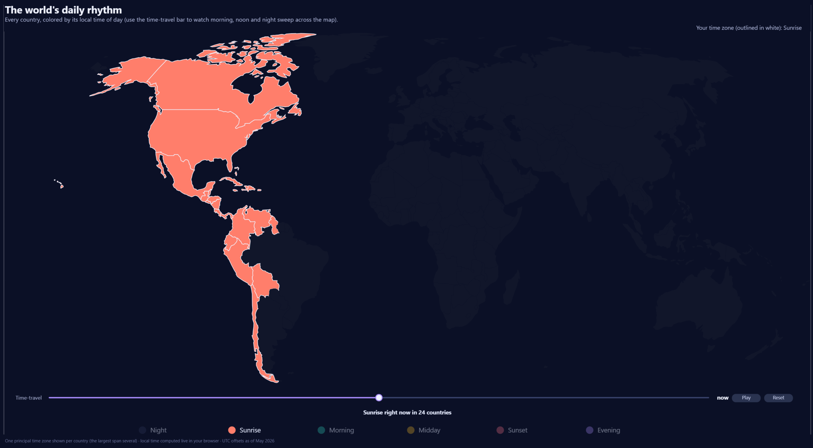
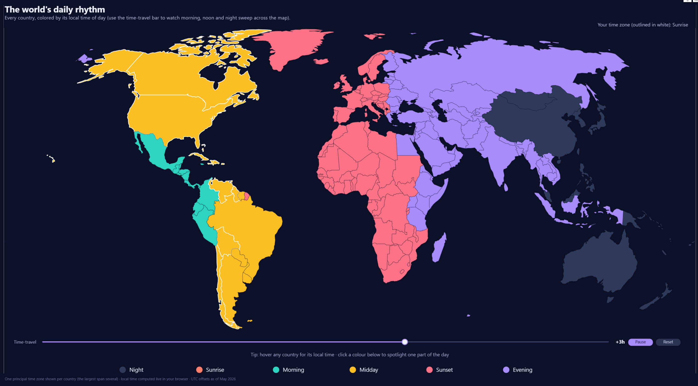

# The World's Daily Rhythm 🌍

A **live, time-aware world map** built in Power BI — every country coloured by its local time of day, computed *live in your browser*. Drag the time-travel bar (or hit **Play**) and watch morning, noon and night sweep across the planet.

Built for the **Microsoft Fabric Miniviz** challenge — *May 2026, Week 4: "Where are the good vibes."*



---

## What it does

- Shades every country by its current **local time of day** — one of six buckets: **Night · Sunrise · Morning · Midday · Sunset · Evening**.
- The colour band sweeps **west → east** as the Earth turns.
- 🎚️ **Time-travel slider + Play button** — animate a full 24-hour cycle on demand.
- 📍 **Your own time zone** is outlined in white, pinned to your real local time.
- 🔦 **Click a colour** to spotlight just that part of the day.

## See it in action

**Spotlight a single part of the day** — click a colour in the legend and the rest of the world dims, with a live count of how many countries are in it:



**Time-travel** — drag the bar (or hit Play) to send the band sweeping around the globe. Same instant, pushed a couple of hours ahead:



## Why it's interesting (the craft)

- **It's genuinely live.** DAX `NOW()` freezes at the last data refresh — useless for this. Instead, each country's local time is computed *client-side* with Deneb/Vega's `now()`. Whoever opens it sees their real current moment, no refresh required.
- **It survives publish-to-web.** Published Power BI reports block external data fetches, so the entire world map geometry is **embedded directly inside the Vega spec** — it renders reliably anywhere, including the public gallery.
- **Built in Deneb (Vega, not Vega-Lite)** — the live clock, the animation timer, and the interactive legend all need Vega's signals.

## How it's built

A **Power BI Project (PBIP)** — TMDL semantic model + PBIR report — with a small, reproducible build pipeline:

| Step | Script | Output |
|---|---|---|
| 1 | `scripts/build_countries.py` | `build/countries.json` — country → ISO id + DST-aware UTC offset (via `pytz`/`pycountry`) |
| 2 | `scripts/build_tmdl.py` | `Countries.tmdl` — the semantic-model table |
| 3 | `scripts/build_geometry.py` | `build/world-110m.min.json` — world-atlas `countries-110m`, Antarctica trimmed |
| 4 | `scripts/inline_topojson.py` | `build/vibe-map.built.json` — Vega spec with geometry inlined |
| 5 | `scripts/embed_spec.py` | embeds the built spec into the Deneb `visual.json` |

## Repo layout

```
deneb/vibe-map.vega.json          # the Vega spec — source of truth
scripts/                          # the build pipeline (above)
minviz-week4.SemanticModel/       # TMDL semantic model (Countries table)
minviz-week4.Report/              # PBIR report (the Deneb visual)
docs/superpowers/                 # design spec + implementation plan
```

## Rebuild it yourself

```bash
pip install pytz pycountry pycountry-convert
python scripts/build_countries.py
python scripts/build_tmdl.py
python scripts/build_geometry.py
python scripts/inline_topojson.py
python scripts/embed_spec.py
```

Then open `minviz-week4.pbip` in Power BI Desktop. *(The Deneb visual auto-loads from AppSource on first open — internet required once.)*

## Notes & honest simplifications

- **One principal time zone per country** (the largest — Canada, the US, Russia — span several). A clean, intentional simplification for a "Miniviz."
- **UTC offsets baked at May 2026** (DST-aware at build time), so the map is accurate for the contest window.

## Tools

**Power BI** · **Deneb** · **Vega** · **TopoJSON** · **Python**
